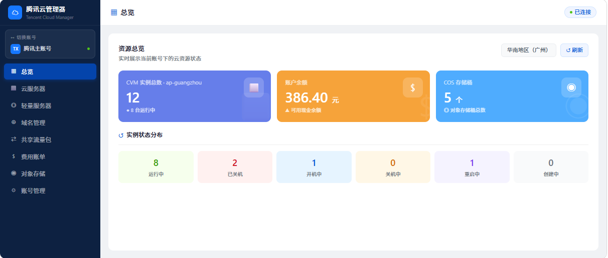

# 腾讯云管理器 (txy-manager)

一个管理多个腾讯云账号的桌面应用，基于 Electron + React + TypeScript 构建。



## 功能

- **多账号管理** — 添加、切换多个腾讯云账号，密钥使用系统级加密存储（DPAPI / Keychain）
- **CVM 云服务器** — 查看实例列表、开机/关机/重启、VNC 远程控制台、安全组规则管理
- **Lighthouse 轻量服务器** — 实例管理、防火墙规则配置
- **DNSPod 域名解析** — 域名列表、DNS 记录增删改查、域名状态管理
- **COS 对象存储** — 存储桶浏览、文件上传/下载/删除、创建文件夹
- **费用账单** — 账户余额查询、月度账单汇总
- **流量包** — 查看、购买、删除 CVM 流量包
- **SSH 终端** — 内置终端，直连 CVM 实例

## 技术栈

| 层 | 技术 |
|---|---|
| 桌面框架 | Electron 33 |
| 前端 | React 18 + TypeScript 5.6 |
| 构建 | Vite 6 |
| UI | Ant Design 5 |
| 状态管理 | Zustand |
| 终端 | xterm.js + ssh2 |
| 云 API | tencentcloud-sdk-nodejs + cos-nodejs-sdk-v5 |
| 安全存储 | Electron safeStorage (DPAPI / Keychain) |

## 开发

```bash
# 安装依赖
npm install

# 启动开发模式（Vite + Electron 并行）
npm run dev

# 构建生产版本
npm run build
```

## 项目结构

```
electron/           # Electron 主进程
  main.ts           # 窗口、菜单
  preload.ts        # 上下文桥接
  ipc/              # IPC 通信层
  api/              # 腾讯云 API 封装
  store/            # 凭证加密存储
src/                # 渲染进程 (React)
  pages/            # 各功能页面
  components/       # 共用组件
  store/            # Zustand 状态管理
  types/            # TypeScript 类型定义
```

## 安全说明

- SecretId / SecretKey 通过 Electron `safeStorage` 加密存储，仅当前操作系统用户可解密
- 运行数据保存在系统用户目录 (`%APPDATA%/txy-manager/data/`)，不在项目目录内
- API 调用直连腾讯云，不经过任何第三方服务器

## 免责声明

本工具为第三方开源软件，**非腾讯云官方产品**。使用本工具产生的任何云资源费用、数据安全风险由使用者自行承担。请妥善保管你的 API 密钥。

## License

[MIT](LICENSE)
